# <strong> My Portfolio </strong>

## [1. Todolist with Login - Vuejs](https://github.com/lukemariano/todolist-login)

### <strong>Login Screen:</strong>

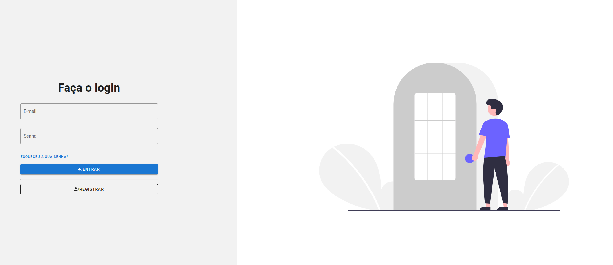

### <strong>Register Screen:</strong>

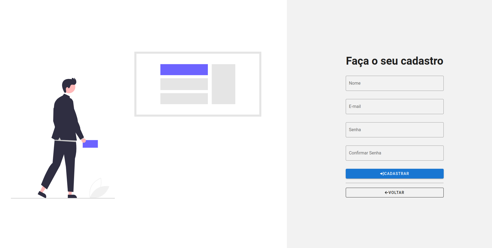

### <strong>Home Screen:</strong>

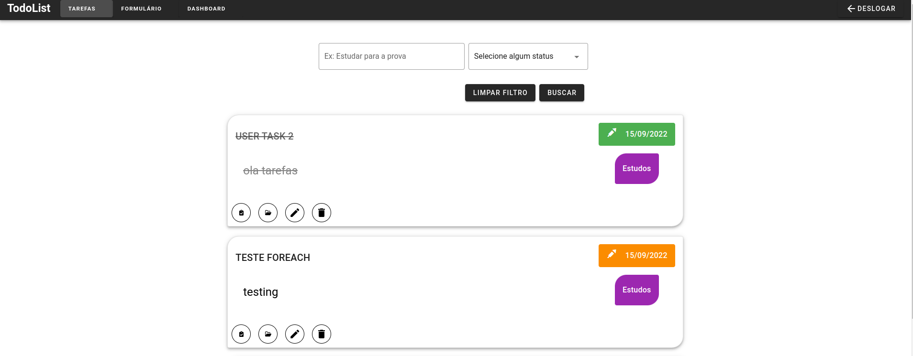

### <strong>Dashboard:</strong>

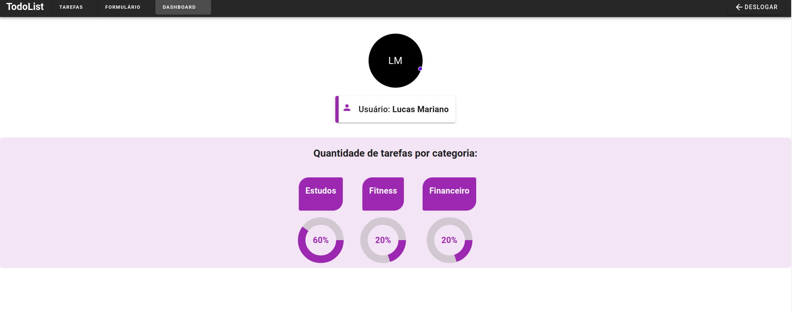

## [2. Make Burguer Crud - Vuejs](https://github.com/lukemariano/make-burguer-crud)

### <strong>App Home Screen:</strong>

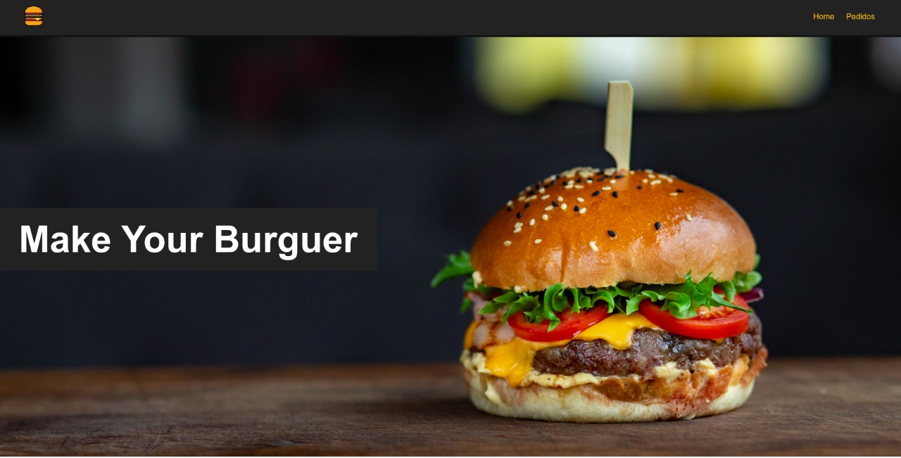

### <strong>Order Form:</strong>

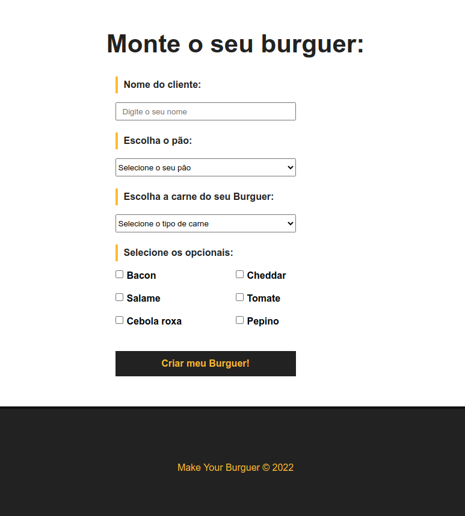

### <strong>Order Screen:</strong>

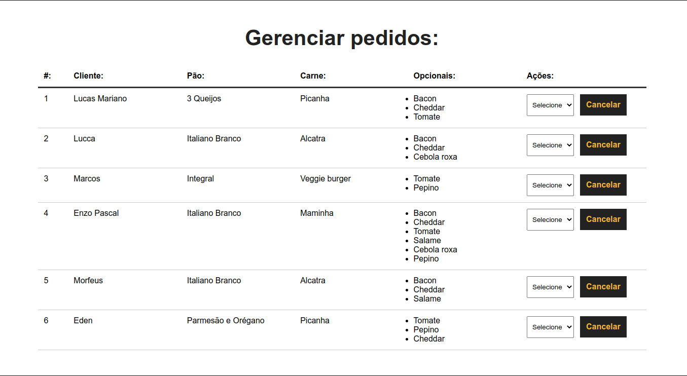

## [3. Buser App - front-end](https://github.com/lukemariano/D7-Buscador)

## [4. Game of Life - Vuejs](https://github.com/lukemariano/coding-game-of-life)

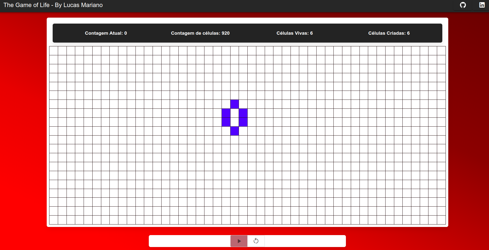

##  6. Supervised machine learning algorithm with simple linear regression model 

### <strong> Notation: </strong>

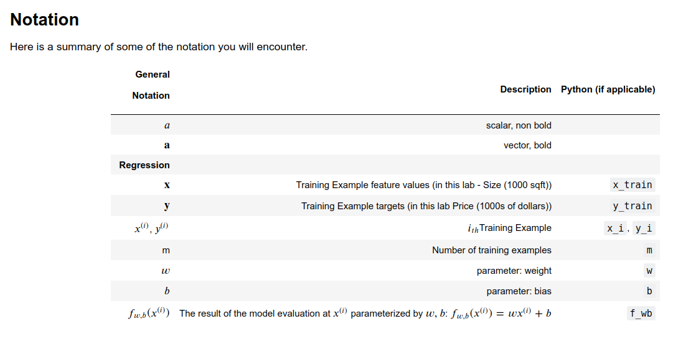

### <strong> Example: </strong>

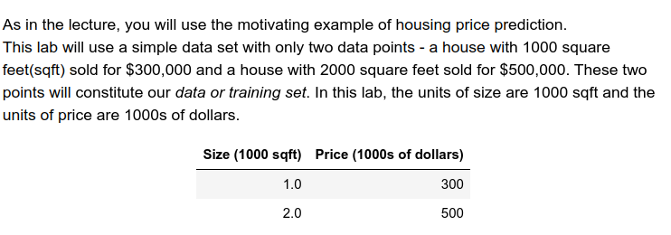

### <strong> Model for Forecasting: </strong>

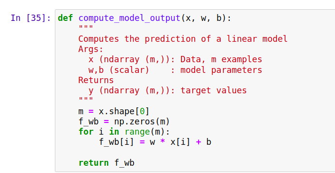

### <strong> Model Training Output: </strong>

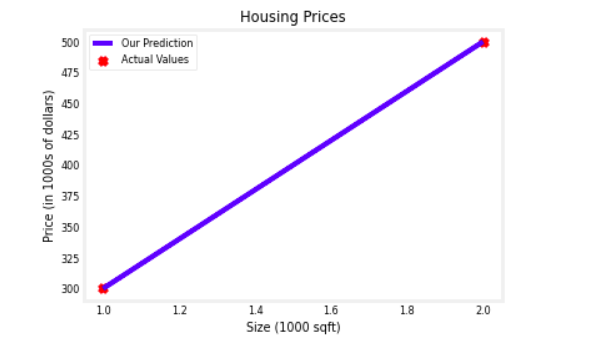

##  6. Other projects: 

- [Web Scraping - Python](https://github.com/lukemariano/web-scraping);
- [Training Pandas](https://github.com/lukemariano/-I-love-pandas);
- [Training Javascript - Parte 1](https://github.com/lukemariano/origamid-js-exercices);
- [Training Javascript - Parte 2](https://github.com/lukemariano/javascript-exercices);
- [Final Project Django CS50 Harvard](https://github.com/lukemariano/Flights);
- [List of Python Brazil exercises](https://github.com/lukemariano/lista-de-exercicios-python-brasil);
